# 💎 SwarnaVeda – AWS 3-Tier Microservices Architecture Deployment

## 📌 Project Overview

SwarnaVeda is a luxury jewellery web application built using **Node.js, Express, and MongoDB**.
This project demonstrates how a real-world application can be deployed using a **3-tier architecture on AWS**, ensuring **scalability, security, and high availability**.

---

## 🏗 Architecture Overview

```
Users (Browser)
      ↓
Application Load Balancer (Public Subnets)
      ↓
EC2 Auto Scaling Group (Private App Subnets)
      ↓
MongoDB Atlas (Data Layer)
```

---

## ⚙️ Technologies Used

### ☁️ Cloud (AWS)

* Amazon VPC
* Subnets (Public & Private)
* Internet Gateway
* NAT Gateway
* Route Tables
* Security Groups
* Application Load Balancer (ALB)
* Target Group
* Launch Template
* Auto Scaling Group
* Amazon EC2

### 💻 Backend

* Node.js
* Express.js
* MongoDB (Mongoose)

### 🌐 Frontend

* HTML, CSS, JavaScript

### 🛠 DevOps Tools

* Nginx (Reverse Proxy)
* PM2 (Process Manager)

---

## 🎯 Key Features

* Fully functional **3-tier architecture**
* **Private App Layer** (secure EC2 instances)
* **Public Load Balancer** for traffic distribution
* **Auto Scaling Group** for scalability
* **MongoDB Atlas** as external data tier
* **Nginx reverse proxy** for production setup
* Secure communication via **Security Groups**
* High availability using **multi-AZ architecture**

---

## 🧠 Architecture Explanation

### 1️⃣ Presentation Layer

* Application Load Balancer (ALB)
* Receives incoming user requests
* Distributes traffic across multiple instances

### 2️⃣ Application Layer

* EC2 instances inside private subnets
* Runs Node.js backend
* Handles business logic and APIs
* Uses PM2 + Nginx for production stability

### 3️⃣ Data Layer

* MongoDB Atlas (cloud database)
* Stores user, product, and order data
* Accessible only from backend

---

## 🔐 Security Design

* EC2 instances are deployed in **private subnets**
* Database is not directly exposed to the internet
* Security Groups restrict access:

  * ALB → EC2 only
  * EC2 → MongoDB only
* Bastion host used for secure SSH access

---

## 🚀 Deployment Steps

### 1. Create VPC

* CIDR: `10.0.0.0/16`
* Create public and private subnets across 2 AZs

📸 Screenshot: `02-vpc-created.png`
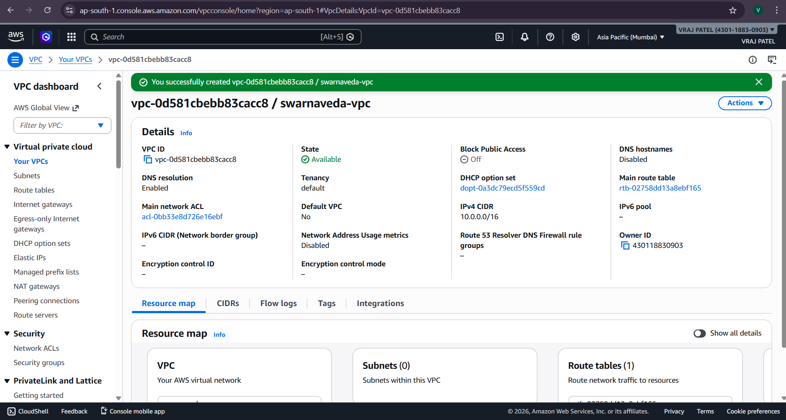
---

### 2. Create Subnets

* Public Subnets → ALB, NAT
* Private Subnets → EC2

📸 Screenshot: `03-subnets-created.png`
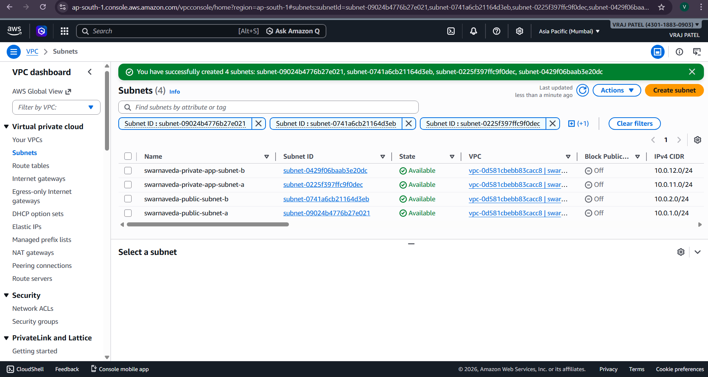
---

### 3. Setup Internet Gateway

* Attach IGW to VPC

📸 Screenshot: `04-igw-attached.png`
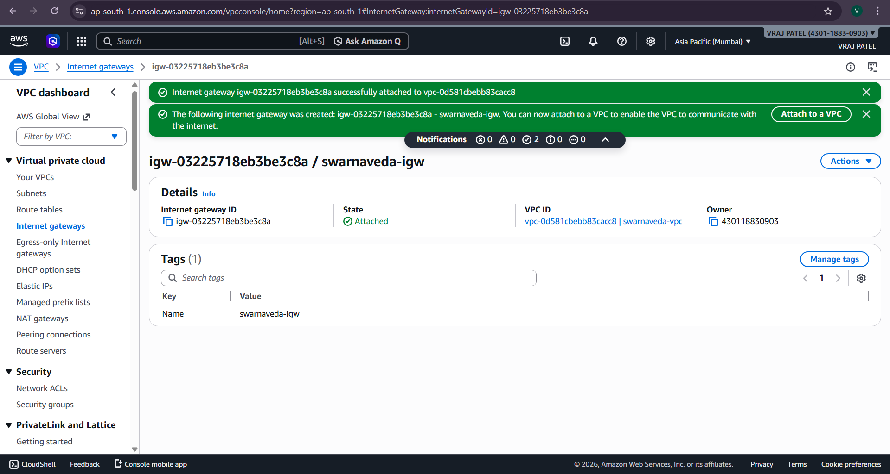
---

### 4. Configure Route Tables

* Public RT → Internet Gateway
* Private RT → NAT Gateway

📸 Screenshot: `05-public-route-table.png`
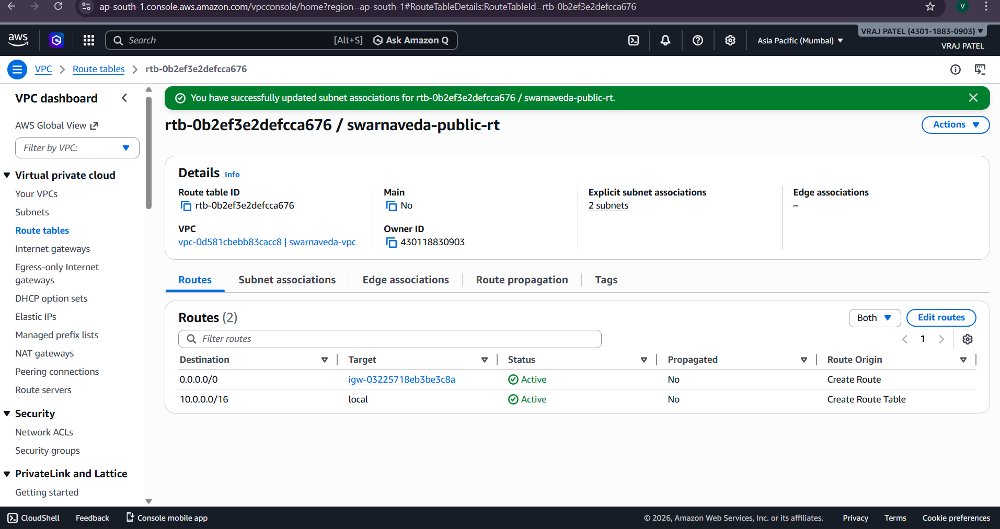
---

### 5. Create NAT Gateways

* One per AZ for high availability

📸 Screenshot: `06-nat-gateways.png`
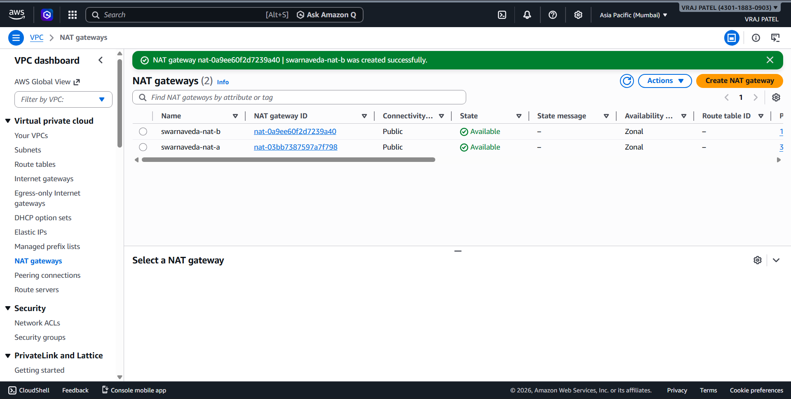
---

### 6. Create Security Groups

* ALB SG → HTTP access
* App SG → Allow ALB traffic
* Bastion SG → SSH access

📸 Screenshot: `09-security-groups.png`
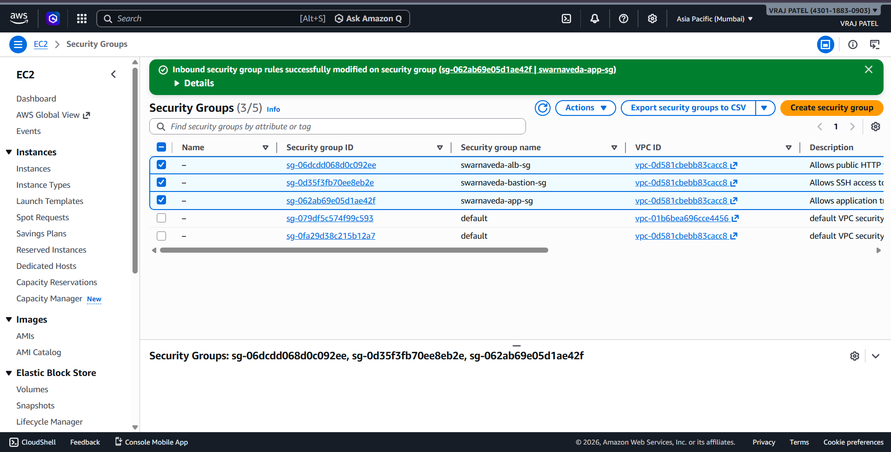
---

### 7. Setup MongoDB Atlas

* Create cluster
* Add network access
* Get connection string

📸 Screenshots:

* `10-mongodb-atlas-network-access.png`
* `11-mongodb-atlas-cluster.png`
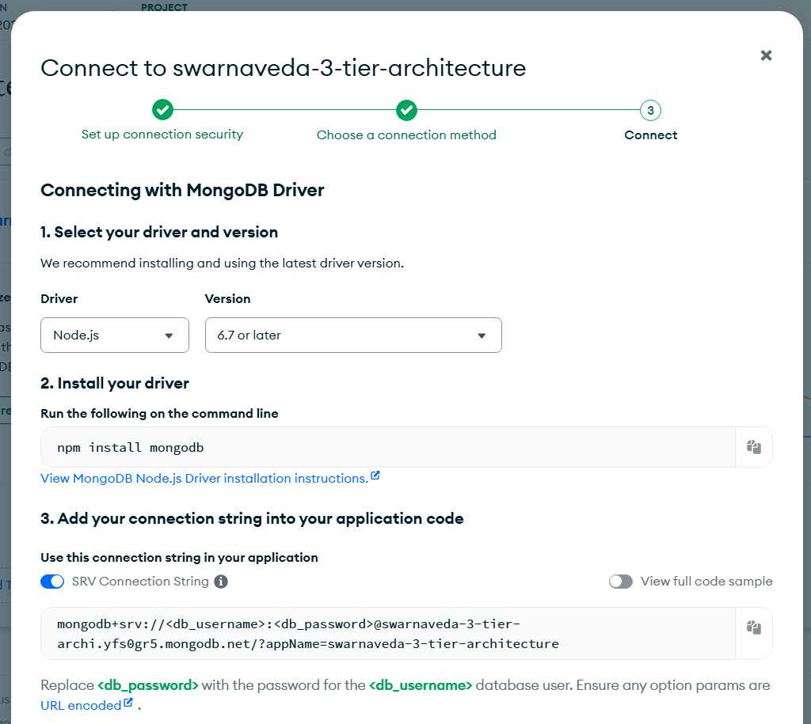
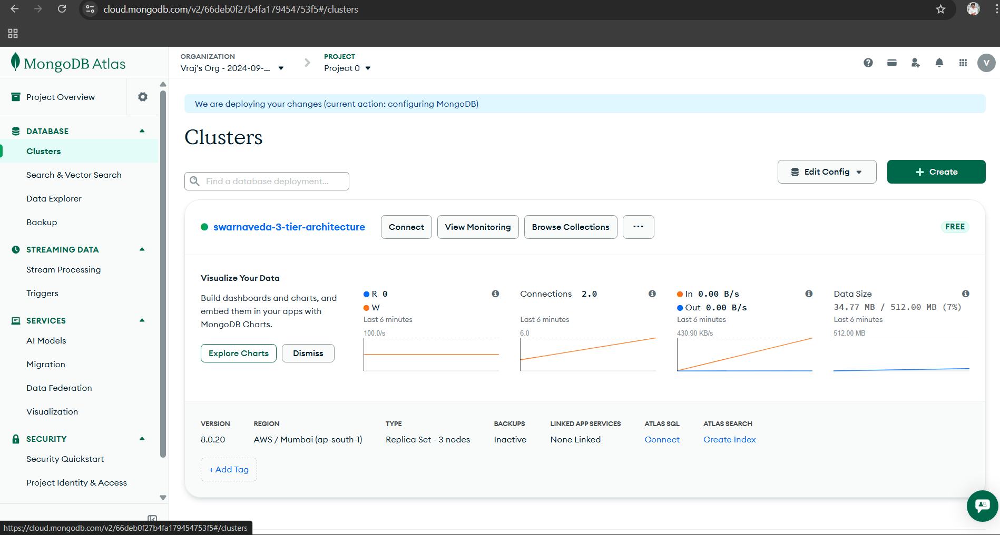
---

### 8. Launch Bastion Host

* Public subnet
* Used for SSH access

📸 Screenshot: `12-bastion-created.png`
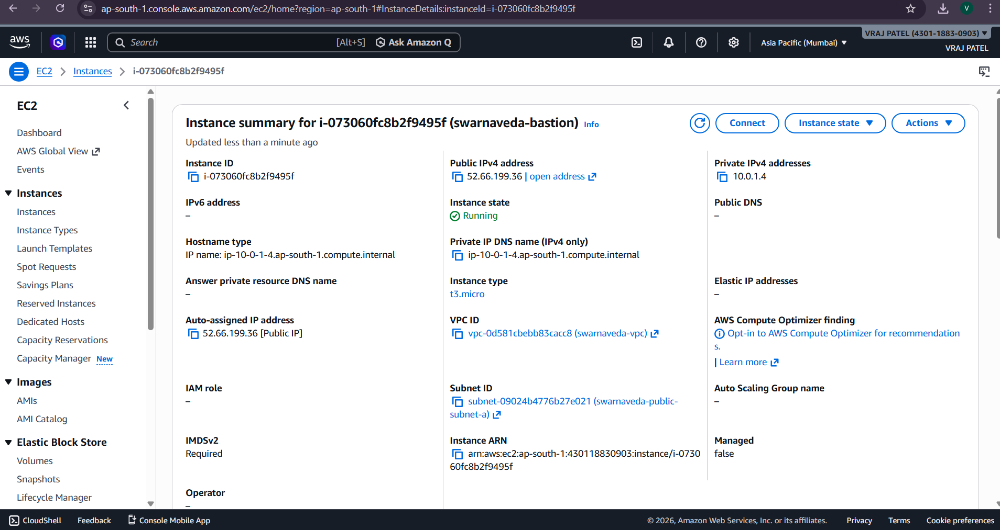
---

### 9. Create Launch Template

* Ubuntu + Node.js + PM2 + Nginx
* Deploy app using GitHub

📸 Screenshot: `13-launch-template-created.png`
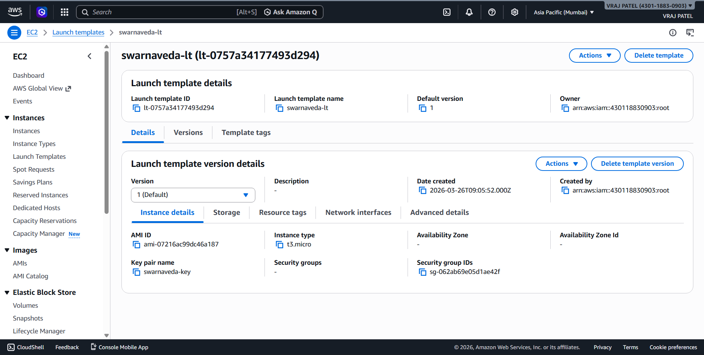
---

### 10. Create Target Group

* Port: 80
* Health check path: `/`

📸 Screenshot: `14-target-group-created.png`
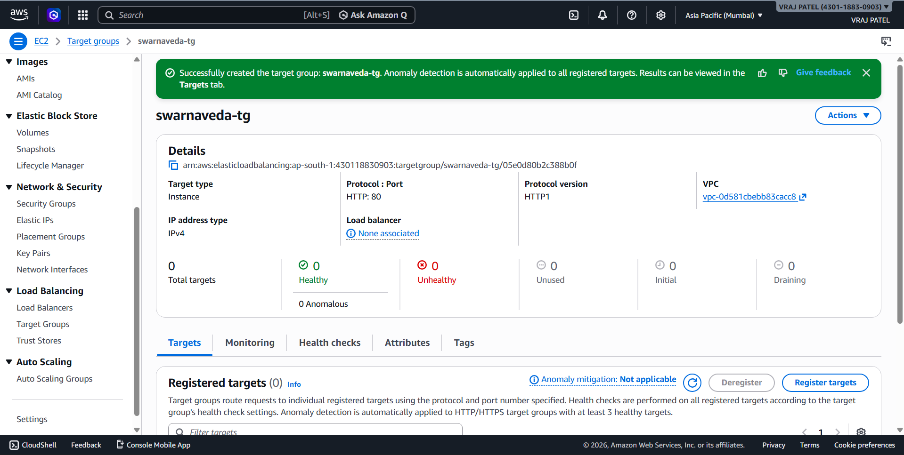
---

### 11. Create Application Load Balancer

* Public subnets
* Forward traffic to target group

📸 Screenshot: `15-load-balancer-created.png`
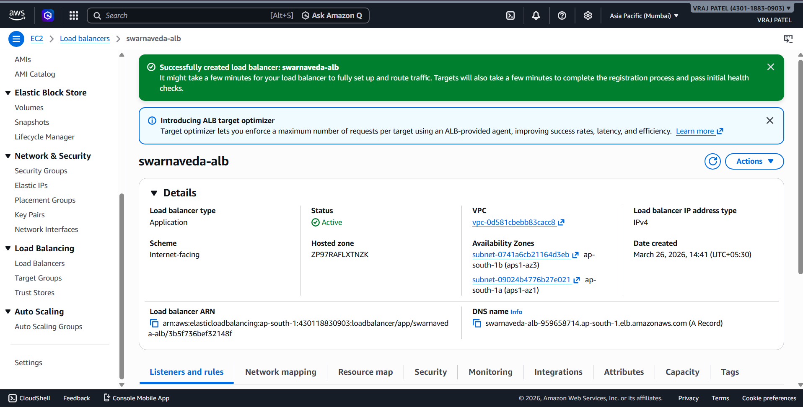
---

### 12. Create Auto Scaling Group

* Min: 1
* Desired: 1
* Max: 2

📸 Screenshot: `16-auto-scaling-group-created.png`
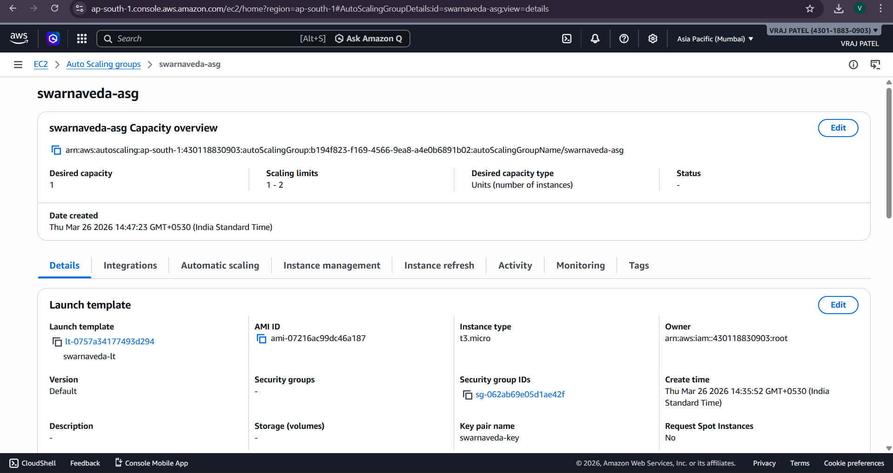
---

### 13. Verify Deployment

* Check EC2 instance running
* Check target group health
* Access website via ALB DNS

📸 Screenshots:

* `21-target-group-healthy.png`
* `22-website-open-via-alb.png`
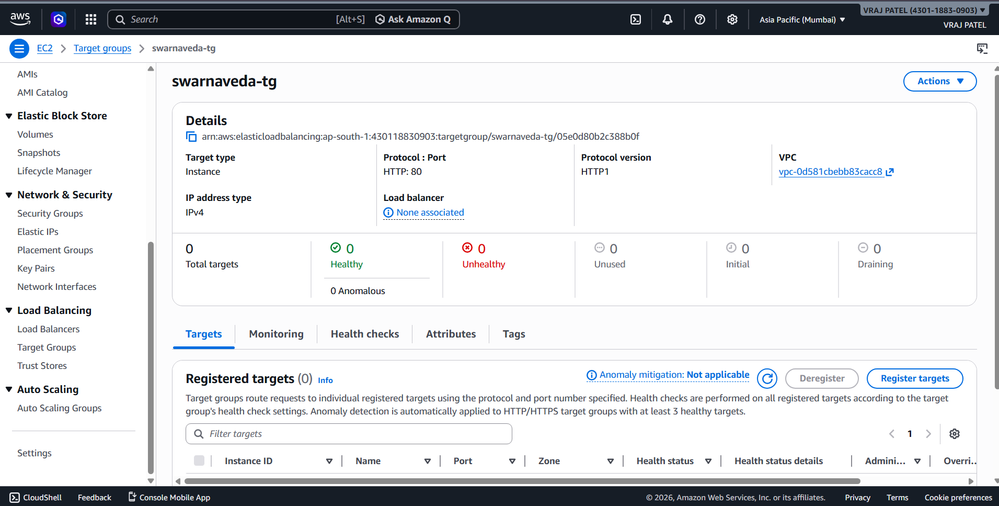
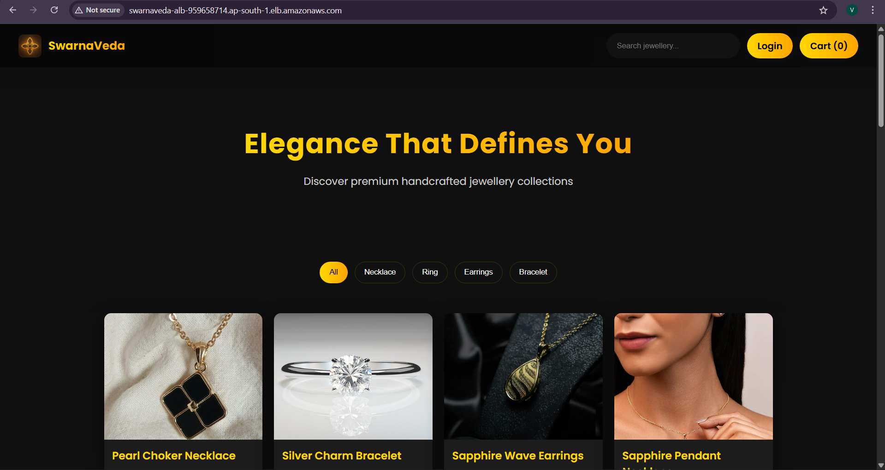
---

### 14. API Testing

```
http://<ALB-DNS>/api/products

```

📸 Screenshot: `23-api-proof.png`
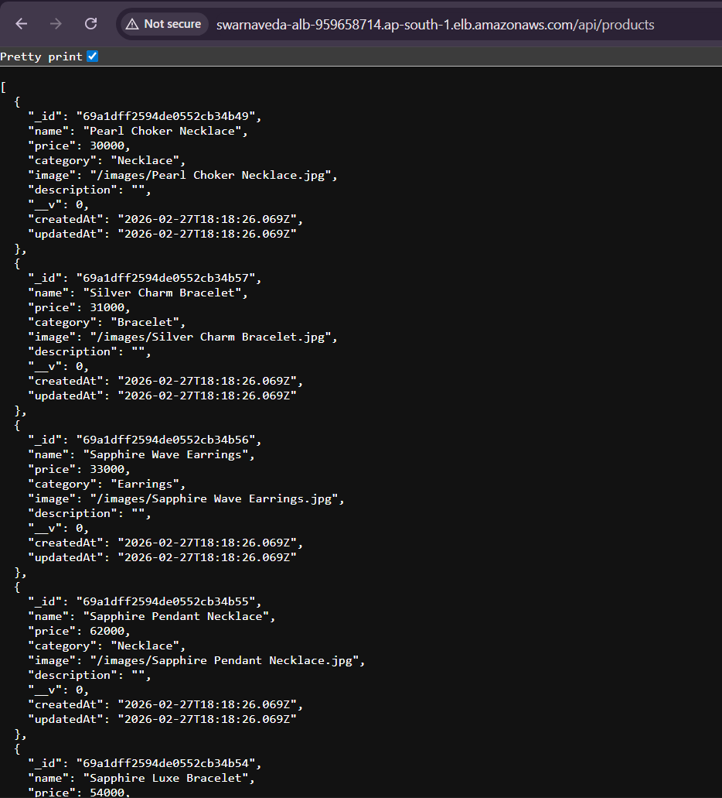
---

All screenshots are stored in:

```
docs/screenshots/
```

---

## 📊 Architecture Diagram

Add your diagram here:

```
docs/architecture/swarnaveda-architecture.png
```

---

## 💼 Resume Line

> Designed and deployed a production-grade 3-tier architecture on AWS using VPC, EC2, Application Load Balancer, Auto Scaling, and MongoDB Atlas with secure networking and high availability across multiple Availability Zones.

---

## ⚠️ Cost Optimization Note

* NAT Gateway and ALB are not free-tier services
* All resources were deleted immediately after testing
* Deployment performed for learning and documentation purposes only

---

## 🧹 Cleanup Steps (IMPORTANT)

Delete resources in this order:

1. Auto Scaling Group
2. Launch Template
3. Load Balancer
4. Target Group
5. Bastion EC2 instance
6. NAT Gateways
7. Elastic IPs
8. Route Tables
9. Internet Gateway
10. Subnets
11. Security Groups
12. VPC

---

## 🎯 Learning Outcomes

* Understood real-world **cloud architecture design**
* Implemented **secure networking (public vs private)**
* Learned **load balancing and scaling**
* Built **production-ready deployment pipeline**
* Gained hands-on experience with AWS services

---

## 👨‍💻 Author

**Vraj Patel**
B.Tech IT | Cloud & DevOps Enthusiast

---
